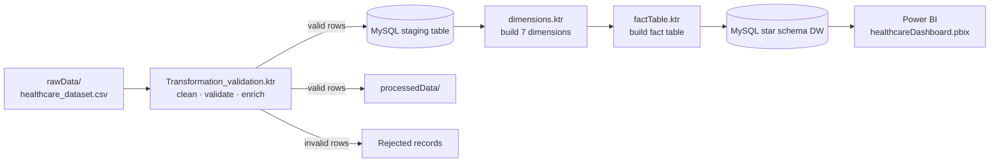
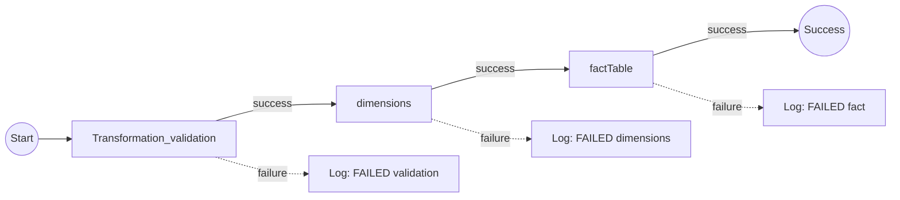
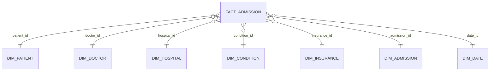

# 🏥 Automated Healthcare ETL Pipeline

An end-to-end, automated ETL pipeline built with **Pentaho Data Integration (Kettle)** that ingests raw hospital admission records, validates and cleans them, engineers analytical features, and loads them into a **star schema data warehouse**. The result feeds a **Power BI dashboard**.

> 📄 Full write-up: [Final Report Data Engineering.pdf](./Final%20Report%20Data%20Engineering.pdf)

---

## ✨ Highlights

- **One-click orchestration**: a single Pentaho job (`healthcareJob.kjb`) runs the whole pipeline in order.
- **Data quality gates**: duplicate removal, string standardisation, domain checks, and null checks. Invalid rows are routed to separate outputs instead of being silently dropped.
- **Feature engineering**: length of stay, admission risk score, test-result risk score, and calendar attributes.
- **Dimensional model**: one fact table with 7 dimensions (patient, doctor, hospital, condition, date, insurance, admission).
- **Fail-fast error handling**: each stage writes its own log file, and a failure stops the job and writes an `[FAILED]` entry to the log.

---

## 🏗️ Architecture



### Job flow (`healthcareJob.kjb`)



---

## 🔄 Pipeline Stages

### 1. Validation & Transformation (`Transformation_validation.ktr`)

| Step | What it does |
|---|---|
| Ingest | Reads `rawData/healthcare_dataset.csv` (15 columns) |
| Deduplicate | Sorts and removes duplicate rows |
| Standardise | Cleans strings and fixes inconsistent letter casing in names |
| Domain validation | Checks gender, blood type, admission type, and test results against allowed values |
| Null handling | Detects missing values and routes those rows to a reject stream |
| Enrichment | Adds `length_of_stay_days`, `admission_year`, `admission_month`, `day_of_week_num` |
| Risk scoring | `admission_risk_score`: Emergency = 2, Urgent = 1, Elective = 0, plus a test-result risk score |
| Load | Writes clean rows to a staging table and to a text file in `processedData/` |

### 2. Dimensions (`dimensions.ktr`)

Reads from staging, deduplicates each entity, assigns surrogate keys, and loads:

`dim_patient` · `dim_doctor` · `dim_hospital` · `dim_condition` · `dim_insurance` · `dim_admission` · `dim_date`

`dim_date` includes year, quarter, month, week of year, day of year, and weekday name.

### 3. Fact table (`factTable.ktr`)

Looks up surrogate keys from each dimension and loads the fact table with measures such as billing amount, length of stay, and risk scores.

---

## ⭐ Star Schema



Exported tables are available in [`starSchema/`](./starSchema).

---

## 📊 Dashboard

<!-- TODO: add 1–2 screenshots of the dashboard, e.g. docs/dashboard.png -->
<!--  -->

Open `healthcareDashboard.pbix` with Power BI Desktop.

---

## 📁 Repository Structure

```
.
├── rawData/                         # Source CSV
├── processedData/                   # Cleaned output from the validation stage
├── starSchema/                      # Exported dimension and fact tables
├── logs/                            # Per-stage execution logs
├── Transformation_validation.ktr    # Stage 1: clean, validate, enrich
├── dimensions.ktr                   # Stage 2: build dimensions
├── factTable.ktr                    # Stage 3: build fact table
├── healthcareJob.kjb                # Orchestration job
├── healthcareDashboard.pbix         # Power BI dashboard
├── run_pipeline.bat / .sh           # Run the job from the command line
└── Final Report Data Engineering.pdf
```

---

## 🚀 Getting Started

### Prerequisites

- [Pentaho Data Integration](https://pentaho.com/) (Spoon / Kitchen) with Java installed
- MySQL 8 (for staging and the data warehouse)
- MySQL JDBC driver (`mysql-connector-j-*.jar`) copied into `data-integration/lib/`
- Power BI Desktop (to open the dashboard)

### Setup

1. Clone the repo:
   ```bash
   git clone https://github.com/aldrvanda/AutomatedHealthcarePipeline.git
   ```
2. Create an empty MySQL database for the warehouse.
3. In Spoon, create a shared database connection named **`healthcare_mysql`**:
   - Open any `.ktr` file → **View** tab → right-click **Database connections** → **New**
   - Connection type: **MySQL**, access: **Native (JDBC)**
   - Fill in your host, port (default `3306`), database name, username, and password
   - Click **Test**, then **OK**
   - Right-click the new connection → **Share**

   > The name must be exactly `healthcare_mysql`, because all transformations refer to it.
   > Credentials are stored locally in `~/.kettle/shared.xml` and are never committed to this repo.
4. Make sure `rawData/healthcare_dataset.csv` exists.

### Run

From Spoon: open `healthcareJob.kjb` and click **Run**.

From the command line:
```bash
# Windows
run_pipeline.bat

# Linux / macOS
./run_pipeline.sh
```

Logs are written to `logs/`.

---

## 📚 Dataset

Synthetic healthcare dataset from [Kaggle – Healthcare Dataset](https://www.kaggle.com/datasets/prasad22/healthcare-dataset). It contains no real patient data.

---

## 🛠️ Tech Stack


---

## 👤 Author

**aldrvanda** · [GitHub](https://github.com/aldrvanda)
